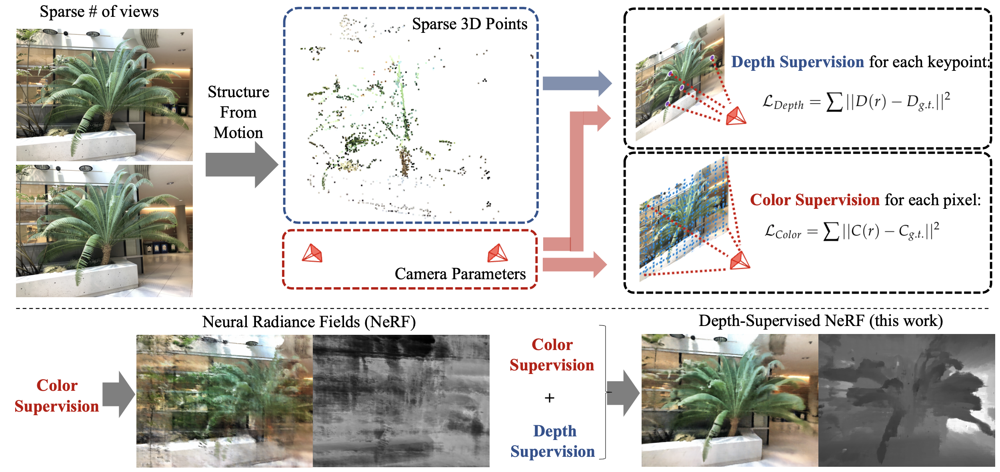

# Depth-supervised NeRF: Fewer Views and Faster Training for Free

[**Project**](https://www.cs.cmu.edu/~dsnerf/) | [**Paper**](https://arxiv.org/abs/2107.02791) | [**YouTube**](https://youtu.be/84LFxCo7ogk)

Pytorch implementation of our method for learning neural radiance fields that takes advantage of depth supervised by 3D point clouds. It can be used to train NeRF models given only very few input views.

<p align="center">
  
</p>


[Depth-supervised NeRF: Fewer Views and Faster Training for Free](https://www.cs.cmu.edu/~dsnerf/)

arXiv 2107.02791, 2021

 [Kangle Deng](https://dunbar12138.github.io/)<sup>1</sup>,
 [Andrew Liu](https://andrewhliu.github.io/)<sup>2</sup>,
 [Jun-Yan Zhu](https://www.cs.cmu.edu/~junyanz/)<sup>1</sup>,
 [Deva Ramanan](https://www.cs.cmu.edu/~deva/)<sup>1,3</sup>,

<sup>1</sup>CMU, <sup>2</sup>Google, <sup>3</sup>Argo AI

---

We propose DS-NeRF (Depth-supervised Neural Radiance Fields), a model for learning neural radiance fields that takes advantage of depth supervised by 3D point clouds. Current NeRF methods require many images with known camera parameters -- typically produced by running structure-from-motion (SFM) to estimate poses and a sparse 3D point cloud. Most, if not all, NeRF pipelines make use of the former but ignore the latter. Our key insight is that such sparse 3D input can be used as an additional free signal during training.

<p align="center">
  
</p>

## Results

NeRF trained with 2 views:
<p align="center">
  
</p>

DS-NeRF trained with 2 views:
<p align="center">
  
</p>

NeRF trained with 5 views:
<p align="center">
  
</p>

DS-NeRF trained with 5 views:
<p align="center">
  
</p>

---


## Quick Start

### Dependencies

Install requirements:
```
pip install -r requirements.txt
```

You will also need [COLMAP](https://github.com/colmap/colmap) installed to compute poses if you want to run on your data.

### Data

Download data for the example scene: `fern_2v`
```
bash download_example_data.sh
```

To play with other scenes presented in the paper, download the data [here](https://drive.google.com/drive/folders/14boI-o5hGO9srnWaaogTU5_ji7wkX2S7).

### Pre-trained Models

You can download the pre-trained models [here](https://drive.google.com/drive/folders/1lby-G4163NFi7Ue4rdB9D0cM67d7oskr?usp=sharing). Place the downloaded directory in `./logs` in order to test it later. See the following directory structure for an example:
```
├── logs 
│   ├── fern_2v    # downloaded logs
│   ├── flower_2v  # downloaded logs
```

### How to Run?

#### Generate camera poses and sparse depth information using COLMAP (optional)

This step is necessary only when you want to run on your data.

First, place your scene directory somewhere. See the following directory structure for an example:
```
├── data
│   ├── fern_2v
│   ├── ├── images
│   ├── ├── ├── image001.png
│   ├── ├── ├── image002.png
```

To generate the poses and sparse point cloud:
```
python imgs2poses.py <your_scenedir>
```

#### Testing

Once you have the experiment directory (downloaded or trained on your own) in `./logs`, 

- to render a video:
```
python run_nerf.py --config configs/fern_dsnerf.txt --render_only
```

The video would be stored in the experiment directory.

<!-- - to only compute the evaluation metrics:
```
python run_nerf.py --config configs/fern_dsnerf.txt --eval
``` -->


#### Training

To train a DS-NeRF on the example `fern` dataset:
```
python run_nerf.py --config configs/fern_dsnerf.txt
```

It will create an experiment directory in `./logs`, and store the checkpoints and rendering examples there.

You can create your own experiment configuration to try other datasets.


### Use depth-supervised loss in your own project

We provide a tutorial on how to use depth-supervised loss in your own project [here](resources/tutorial.md).

---

## Citation

If you find this repository useful for your research, please cite the following work.
```
@article{kangle2021dsnerf,
  title={Depth-supervised NeRF: Fewer Views and Faster Training for Free},
  author={Deng, Kangle and Liu, Andrew and Zhu, Jun-Yan and Ramanan, Deva},
  journal={arXiv preprint arXiv:2107.02791},
  year={2021}
}
```

---

## Acknowlegements

This code borrows heavily from [nerf-pytorch](https://github.com/yenchenlin/nerf-pytorch). We thank Takuya Narihira, Akio Hayakawa, Sheng-Yu Wang, and for helpful discussion. We are grateful for the support from Sony Corporation, Singapore DSTA, and the CMU Argo AI Center for Autonomous Vehicle Research.
